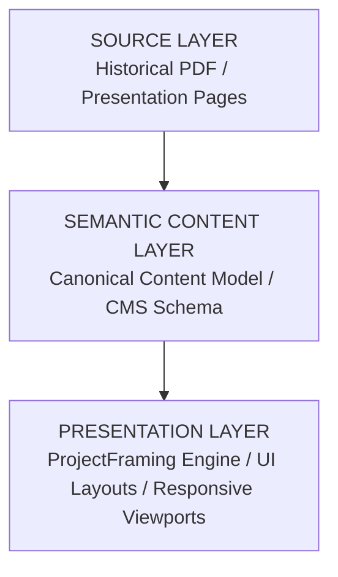

# DEPROS Canonical Portfolio Content Model

**Pass:** 05B — Canonical Portfolio Content Model  
**Date:** October 2026  
**Auditor / Architect:** Antigravity AI  
**Repository:** `nalakara/DEPROS`  
**Status:** Content Contract & Architectural Specification (Design Only — No Code Migration)

---

## 1. Architectural Architecture & Core Principle

This specification establishes the canonical semantic content model for the DEPROS portfolio website. It provides a formal content contract designed to support:
1. The current hard-coded portfolio presentation on the homepage.
2. The future `/work` archive and category filtering system.
3. Future individual project detail routes (`/work/[slug]`).
4. A headless CMS or structured content store migration (e.g. Sanity, Payload, Markdown/MDX collections).

### Fundamental Architectural Principle: Three-Layer Separation
To prevent conflating historical presentation quirks with domain identity, the model strictly isolates three layers:



1. **Source Layer (Provenance):** Captures historical presentation headers, literal page titles, and deck coordinates from `PF DEPROS 2026_B.pdf`.
2. **Semantic Content Layer (Canonical):** Defines stable, normalized entities, taxonomies, clients, and structured project metadata independent of numeric numbering or page layouts.
3. **Presentation Layer (Renderer):** Governs how visual assets are framed, aligned, spaced, and rendered across screen sizes via `ProjectFraming` and responsive viewports.

---

## 2. Category Taxonomy: Source vs. Canonical

### A. Source Category (Literal Historical Deck)
The primary source `PF DEPROS 2026_B.pdf` displays the following literal headers across pages 05–20:
- `01 / DEP ROS PRODUCT DESIGN` (Pages 05–12)
- `02 / DEP ROS BRAND IDENTITY` (Page 13)
- `03 / DEP ROS LOGOS` (Page 14)
- `04 / DEP ROS CORPORATE IDENTITY` (Page 15)
- `MARKETING KIT` *(Unnumbered header)* (Page 16)
- `SALES TOOLS` *(Unnumbered header)* (Page 17)
- `GRAPHIC & VISUAL` *(Unnumbered header)* (Page 18)
- `05/ DEP ROS SOCIAL MEDIA CONTENT` *(Printed with literal index `05`)* (Pages 19–20)

*Note:* The PDF skips numbers between `04` and `05` for intermediate categories, treating `Marketing Kit`, `Sales Tools`, and `Graphic & Visual` as unnumbered sections before resuming with `05/ DEP ROS SOCIAL MEDIA CONTENT`.

---

### B. Canonical Semantic Categories
The canonical content model separates **semantic identity** from **presentation order/display numbers**. The canonical taxonomy consists of **7 stable semantic category IDs**:

| Canonical Category ID | Display Name | Presentation Index | Scope & Intent |
|---|---|---|---|
| `product-design` | Product Design | `01` | CPG packaging, bottle design, label artwork, structural container design. |
| `brand-identity` | Brand Identity | `02` | Comprehensive brand strategy, identity guidelines, uniform, signage & assets. |
| `logos` | Logos | `03` | Logomarks, symbols, wordmarks, brand badges, and mark systems. |
| `corporate-identity` | Corporate Identity | `04` | Corporate collateral, stationery systems, business cards, corporate manuals. |
| `marketing-kit` | Marketing Kit | `05` | Digital publications, e-books, brochures, B2B sales decks, service kits. |
| `graphic-visual` | Graphic & Visual | `06` | Environmental graphics, spatial design, murals, visual cards, print graphics. |
| `social-media-content` | Social Media Content | `07` | Social grid strategy, Instagram feeds, story content, campaign templates. |

#### Semantic Identity Rule
Category meaning, routing slugs, and CMS relations are keyed to the string ID (`product-design`), never to a transient numeric prefix (`"01"`). The numeric index `"01"` is purely an editorial display attribute that can be rendered or omitted according to UI requirements.

---

## 3. Marketing Kit vs. Sales Tools Semantic Modeling

### Decision & Rationale
In the PDF source, Page 16 is headed `MARKETING KIT` (featuring *Eco Mailing E-Book*) and Page 17 is headed `SALES TOOLS` (featuring *Suit Solution Group Service Kit*).

Rather than forcibly flattening or erasing this distinction:
- **Canonical Category:** `marketing-kit`
- **Semantic Subtype (`contentType`):**
  - `marketing-kit` (e.g. E-Books, whitepapers, marketing collateral)
  - `sales-tools` (e.g. B2B pitch decks, service kits, sales presentations)
- **Source Header Provenance:** The literal PDF header (`"MARKETING KIT"` or `"SALES TOOLS"`) is stored in the record's `provenance` block.

```typescript
// Example: Eco Mailing (Page 16)
{
  category: "marketing-kit",
  contentType: "marketing-kit",
  provenance: { sourceCategory: "MARKETING KIT", sourcePage: 16 }
}

// Example: Suit Solution Group (Page 17)
{
  category: "marketing-kit",
  contentType: "sales-tools",
  provenance: { sourceCategory: "SALES TOOLS", sourcePage: 17 }
}
```

---

## 4. Presentation Type Distinction

The canonical model recognizes two fundamental structural presentation patterns:

```typescript
export type PresentationType = "standalone" | "grouped";
```

### 1. `standalone` (14 items in Source)
A standard portfolio case study representing a single coherent client engagement.
- Features one client, unified scope, and a dedicated image or multi-panel visual set.
- Maps directly to a standard detail page or standalone archive card.
- **Items:** `janus-bifrous`, `coco-flamingo`, `kraken-rum`, `blonde-ale`, `locale-fruit-wine`, `mini-liqueur-party`, `berassa-snack`, `arin-arak`, `mitra-kopling`, `whysuper-millimeter`, `e-book-marketing`, `sales-tools`, `locale-social`, `kopi-tungku`.

### 2. `grouped` (2 items in Source)
A showcase, index, or collage presentation combining multiple distinct works or brand marks into a single curated overview.
- Does not enforce a single client name (uses `Multiple / Various` or studio curated context).
- Prevents artificially breaking curated overview spreads into speculative micro-projects.
- **Items:**
  1. `logos-collection` (Page 14): Selected marks and symbols across multiple clients (2020–2026).
  2. `graphic-visual` (Page 18): Environmental and spatial collage (`FLOOR / WALL IMAGES / VISUAL CARD / GRAPHIC & ELSE`).

---

## 5. Canonical Portfolio Entry Schema Contract

```typescript
/**
 * Canonical Semantic Category IDs
 */
export type SemanticCategoryId =
  | "product-design"
  | "brand-identity"
  | "logos"
  | "corporate-identity"
  | "marketing-kit"
  | "graphic-visual"
  | "social-media-content";

/**
 * Semantic Content Subtype for specialized categorizations
 */
export type ContentSubtype =
  | "standard"
  | "marketing-kit"
  | "sales-tools"
  | "showcase-grid"
  | "environmental-collage";

/**
 * Structural Presentation Type
 */
export type PresentationType = "standalone" | "grouped";

/**
 * Image Role in Presentation
 */
export type ImageRole = "hero" | "primary" | "detail" | "supporting" | "composite";

/**
 * Image Orientation
 */
export type ImageOrientation = "portrait" | "landscape" | "square" | "panoramic";

/**
 * Canonical Asset Reference
 */
export interface CanonicalImage {
  src: string;
  alt: string;
  width: number;
  height: number;
  aspectRatio?: number; // width / height
  orientation?: ImageOrientation;
  role?: ImageRole;
  caption?: string;
}

/**
 * Presentation Layer Framing Configuration
 */
export interface PresentationFramingConfig {
  mode: "auto" | "editorial";
  editorialRows?: number[][];
  gap?: "none" | "hairline" | "sm" | "md";
  mobileStack?: boolean;
}

/**
 * Source Provenance Metadata (Audit / Traceability)
 */
export interface SourceProvenance {
  sourceDocument: string;    // e.g. "PF DEPROS 2026_B.pdf"
  sourcePage: number;        // e.g. 5
  sourceCategory: string;    // e.g. "01 / DEP ROS PRODUCT DESIGN"
  sourceTitle: string;       // e.g. "JANUS BIFROUS"
  sourceSubtitle?: string;   // e.g. "Artisan Beer"
  sourceClient?: string;     // e.g. "Locale Brewery"
}

/**
 * Canonical Portfolio Entry
 */
export interface CanonicalPortfolioEntry {
  // Identity
  id: string;                                // Immutable unique ID (e.g. "janus-bifrous")
  slug: string;                              // URL-safe routing slug (e.g. "janus-bifrous")
  title: string;                             // Canonical display title (e.g. "Janus Bifrous")

  // Classification
  category: SemanticCategoryId;              // Stable category ID (e.g. "product-design")
  presentationType: PresentationType;        // "standalone" | "grouped"
  contentType?: ContentSubtype;              // e.g. "marketing-kit" | "sales-tools"

  // Client Metadata
  client?: string;                           // Client name if established by source
  clientDisplayName?: string;                // Formatted display name if different from legal name

  // Content & Editorial
  subtitle?: string;                         // Verified descriptor / subtitle
  description?: string;                      // Project summary (omitted if unverified)
  scope?: string[];                          // Array of verified services / scope items

  // Chronology
  year?: string;                             // Project year (omitted if not verified by source)

  // Media
  heroImage: CanonicalImage;                 // Primary standalone / fallback hero asset
  images?: CanonicalImage[];                 // Array of multi-image panels / showcase assets
  framingConfig?: PresentationFramingConfig; // Layout instructions for framing engine

  // Source Provenance
  provenance: SourceProvenance;              // Traceability back to source PDF

  // Editorial Flags
  featured?: boolean;                        // Homepage visibility flag
  published?: boolean;                       // Archive visibility flag
}
```

---

## 6. Required vs. Optional Fields Classification

| Field | Classification | Rationale & Rules |
|---|---|---|
| `id` | **REQUIRED** | Unique immutable identifier required for keys and internal referencing. |
| `slug` | **REQUIRED** | Required for routing and stable URL generation. |
| `title` | **REQUIRED** | Required for human identification and heading hierarchy. |
| `category` | **REQUIRED** | Mandatory classification for grouping, filtering, and navigation. |
| `presentationType` | **REQUIRED** | Mandatory structural flag (`standalone` vs `grouped`). |
| `heroImage` | **REQUIRED** | Every portfolio item must possess at least one primary visual asset. |
| `provenance` | **REQUIRED** | Ensures complete audit trail back to source deck coordinates. |
| `client` | **OPTIONAL** | Present on standalone client projects; absent on grouped multi-client showcases. |
| `clientDisplayName`| **OPTIONAL** | Used only when source client string requires formatting. |
| `subtitle` | **OPTIONAL** | Populated when source contains a descriptor; omitted otherwise. |
| `description` | **OPTIONAL** | **Strictly optional**. Never invent descriptions if absent from source. |
| `scope` | **OPTIONAL** | **Strictly optional**. Populated only when verifiable. |
| `year` | **OPTIONAL** | **Strictly optional**. Populated only when verifiable (do not guess). |
| `images` | **OPTIONAL** | Array of segmented panels (present on multi-image projects, omitted on single-image items). |
| `framingConfig` | **OPTIONAL** | UI layout instructions; defaults to standard auto framing if omitted. |
| `featured` | **OPTIONAL** | Defaults to `false` if omitted. |
| `published` | **OPTIONAL** | Defaults to `true` if omitted. |

---

## 7. The "Unknown Data" Rule

To maintain rigorous fidelity to the DEPROS archive:

1. **No Hallucinated Chronology:** If the PDF does not print a creation year, `year` must be `undefined` (or omitted). Do not default to the current year or guess based on style.
2. **No Fabricated Scope Lists:** If scope is not explicitly printed or established by verified project materials, leave `scope` as `undefined` or empty.
3. **No Synthetic Marketing Copy:** Marketing descriptions created during early prototyping must be labeled as `REPO-SUPPLIED / NOT VERIFIED AGAINST PDF` and must remain optional in the canonical schema.
4. **Preserve Source Client Names:** Client names must match the source verbatim (e.g. `Kapal Api`, `Locale Brewery`, `Gumindo Bogamanis`).

---

## 8. Current Repository Compatibility Matrix

Comparison between current `src/lib/types.ts` and the proposed Canonical Model:

| Current Repository Field (`types.ts`) | Proposed Canonical Field | Status | Compatibility & Migration Guidance |
|---|---|---|---|
| `id: string` | `id: string` | **Identical** | Direct 1:1 mapping. |
| `number: string` (e.g. `"01"`) | *Removed from semantic model* | **Presentation Only** | Numeric ordering belongs to display components/category indexing, not semantic entity state. |
| `title: string` | `title: string` | **Identical** | Direct 1:1 mapping. |
| `subtitle: string` | `subtitle?: string` | **Relaxed to Optional** | Was mandatory in TypeScript; made optional to support records without descriptors. |
| `category: ProjectCategory`<br>(`"01 / PRODUCT DESIGN"`) | `category: SemanticCategoryId`<br>(`"product-design"`) | **Renamed & Normalized** | Decouples semantic category from hard-coded string with numeric prefix. |
| `categorySlug: string` | *Derived or redundant* | **Normalized** | `category` is now the slug itself (`product-design`). |
| `client: string` | `client?: string` | **Relaxed to Optional** | Accommodates grouped showcase presentations without a single client. |
| `description: string` | `description?: string` | **Relaxed to Optional** | Prevents forcing unverified AI copy into missing records. |
| `image: string` | `heroImage: CanonicalImage` | **Structured** | Upgraded from raw string path to typed `CanonicalImage` object with width/height/alt. |
| `images?: ProjectImage[]` | `images?: CanonicalImage[]` | **Compatible** | Enriched with `aspectRatio` and `role`. |
| `secondaryImage?: string` | *Deprecated / Removed* | **Cleanup** | Legacy field superseded by `images` array and `ProjectFraming`. |
| `year: string` | `year?: string` | **Relaxed to Optional** | Made optional to respect the Unknown Data Rule. |
| `scope: string[]` | `scope?: string[]` | **Relaxed to Optional** | Made optional to respect the Unknown Data Rule. |
| `featured: boolean` | `featured?: boolean` | **Identical** | Direct 1:1 mapping. |
| *(None)* | `presentationType: PresentationType` | **New Field** | Distinguishes `standalone` vs `grouped` presentations. |
| *(None)* | `contentType?: ContentSubtype` | **New Field** | Handles subtypes like `sales-tools` under `marketing-kit`. |
| *(None)* | `provenance: SourceProvenance` | **New Field** | Adds traceability to PDF page and original source header. |

---

## 9. Canonical Image Model & Presentation Decoupling

The image model strictly separates **Content Data** (what the image is and its physical geometry) from **Presentation Configuration** (how the UI frames and aligns it):

```typescript
// CONTENT DATA (Stored with Entity / CMS)
export interface CanonicalImage {
  src: string;          // Asset URI, e.g. "/images/projects/janus-bifrous/bottle-left.png"
  alt: string;          // Descriptive accessible alt text
  width: number;        // Intrinsic physical width in pixels (e.g. 714)
  height: number;       // Intrinsic physical height in pixels (e.g. 795)
  aspectRatio?: number; // Pre-calculated width / height (e.g. 0.8981)
  role?: ImageRole;     // "primary" | "detail" | "supporting" | "composite"
  caption?: string;     // Optional editorial caption
}

// PRESENTATION CONFIGURATION (Governed by Layout Engine / Component Props)
export interface PresentationFramingConfig {
  mode: "auto" | "editorial";
  editorialRows?: number[][]; // e.g. [[0], [1, 2]]
  gap?: "none" | "hairline" | "sm" | "md";
  mobileStack?: boolean;
}
```

### Benefits for Future Headless CMS
1. **Zero Layout Distortion:** Storing intrinsic dimensions (`width` and `height`) enables Next.js Image optimization and CSS flex/grid aspect-ratio calculation without layout shift.
2. **Decoupled Styling:** The CMS stores pure media assets; the Next.js `ProjectFraming` engine dynamically computes proportional layout rows at render time.

---

## 10. Grouped Content Model

Grouped presentations (`Logos Collection` and `Graphic & Visual`) represent multi-work showcases rather than single client deliverables. They are modeled as follows:

```typescript
// Example 1: Logos Collection (Page 14)
export const LOGOS_COLLECTION_CANONICAL: CanonicalPortfolioEntry = {
  id: "logos-collection",
  slug: "logos-collection",
  title: "Logos Collection",
  subtitle: "Selected Marks & Symbols (2020–2026)",
  category: "logos",
  presentationType: "grouped",
  contentType: "showcase-grid",
  client: "Multiple / Various",
  heroImage: {
    src: "/images/projects/logos-collection-hero.png",
    alt: "DEPROS Logos Collection - Selected Marks and Symbols Grid",
    width: 1584,
    height: 800,
    aspectRatio: 1.980,
    role: "composite",
  },
  provenance: {
    sourceDocument: "PF DEPROS 2026_B.pdf",
    sourcePage: 14,
    sourceCategory: "03 / DEP ROS LOGOS",
    sourceTitle: "LOGOS",
    sourceSubtitle: "Selected Marks & Symbols (2020–2026)",
  },
  featured: false,
  published: true,
};

// Example 2: Graphic & Visual (Page 18)
export const GRAPHIC_VISUAL_CANONICAL: CanonicalPortfolioEntry = {
  id: "graphic-visual",
  slug: "graphic-visual",
  title: "Graphic & Visual",
  subtitle: "Floor / Wall Images / Visual Card / Graphic & Else",
  category: "graphic-visual",
  presentationType: "grouped",
  contentType: "environmental-collage",
  client: "Various local brands",
  heroImage: {
    src: "/images/projects/bounce-bali-hero.png",
    alt: "DEPROS Environmental Graphics, Murals, and Visual Collages",
    width: 1584,
    height: 782,
    aspectRatio: 2.026,
    role: "composite",
  },
  provenance: {
    sourceDocument: "PF DEPROS 2026_B.pdf",
    sourcePage: 18,
    sourceCategory: "GRAPHIC & VISUAL",
    sourceTitle: "FLOOR / WALL IMAGES / VISUAL CARD / GRAPHIC & ELSE",
    sourceSubtitle: "Environmental & Spatial Graphic Design",
  },
  featured: false,
  published: true,
};
```

---

## 11. Complete Catalog Mapping to Canonical Model (16 Units)

| # | Canonical ID / Slug | Title | Canonical Category | Subtype | Type | Client | Source Page | Visual Asset Path |
|---|---|---|---|---|---|---|---|---|
| **01** | `janus-bifrous` | Janus Bifrous | `product-design` | `standard` | `standalone` | Locale Brewery | 05 | `/images/projects/janus-bifrous/` (3 panels) |
| **02** | `coco-flamingo` | Coco Flamingo | `product-design` | `standard` | `standalone` | Locale Brewery | 06 | `/images/projects/coco-flamingo/` (3 panels) |
| **03** | `kraken-rum` | Kraken Rum | `product-design` | `standard` | `standalone` | Locale Brewery | 07 | `/images/projects/kraken-rum/` (3 panels) |
| **04** | `blonde-ale` | Blonde Ale / Golden Ale | `product-design` | `standard` | `standalone` | Locale Brewery | 08 | `/images/projects/blonde-ale-hero.png` |
| **05** | `locale-fruit-wine` | Locale Fruit Wine | `product-design` | `standard` | `standalone` | Locale Brewery | 09 | `/images/projects/locale-fruit-wine-hero.png` |
| **06** | `mini-liqueur-party` | Mini Liqueur Party | `product-design` | `standard` | `standalone` | Locale Brewery | 10 | `/images/projects/mini-liqueur-party-hero.png` |
| **07** | `berassa-snack` | Berassa Snack | `product-design` | `standard` | `standalone` | Gumindo Bogamanis | 11 | `/images/projects/berassa-snack-hero.png` |
| **08** | `arin-arak` | Arin Arak Liqueur | `product-design` | `standard` | `standalone` | Arin | 12 | `/images/projects/arin-arak-hero.png` |
| **09** | `mitra-kopling` | Mitra Kopling | `brand-identity` | `standard` | `standalone` | Kapal Api | 13 | `/images/projects/mitra-kopling/` (3 panels) |
| **10** | `logos-collection` | Logos Collection | `logos` | `showcase-grid` | `grouped` | Multiple / Various | 14 | `/images/projects/logos-collection-hero.png` |
| **11** | `whysuper-millimeter` | Whysuper & Millimeter | `corporate-identity` | `standard` | `standalone` | Whysuper & Millimeter | 15 | `/images/projects/whysuper-millimeter/` (3 panels) |
| **12** | `e-book-marketing` | E-Book Marketing Kit | `marketing-kit` | `marketing-kit` | `standalone` | Eco Mailing | 16 | `/images/projects/e-book-marketing-hero.png` |
| **13** | `sales-tools` | Service Kit Sales Tools | `marketing-kit` | `sales-tools` | `standalone` | Suit Solution Group | 17 | `/images/projects/sales-tools-hero.png` |
| **14** | `graphic-visual` | Graphic & Visual | `graphic-visual` | `environmental-collage` | `grouped` | Various local brands | 18 | `/images/projects/bounce-bali-hero.png` |
| **15** | `locale-social` | Locale Instagram Feeds | `social-media-content` | `standard` | `standalone` | Locale Brewery | 19 | `/images/projects/locale-social-hero.png` |
| **16** | `kopi-tungku` | Kopi Tungku Instagram Story | `social-media-content` | `standard` | `standalone` | Kopi Tungku | 20 | `/images/projects/kopi-tungku-hero.png` |

---

## 12. Summary & Implementation Guidelines for Future Passes

1. **Zero UI / Code Disruption:** This pass defines the semantic content contract in documentation only. No files in `src/` or `public/` were modified.
2. **Next Steps (When Authorized):**
   - In subsequent passes, `src/lib/types.ts` can be upgraded to export `CanonicalPortfolioEntry` and `SemanticCategoryId` while providing backwards-compatible aliases for existing components.
   - `src/lib/data.ts` can be expanded with full records for all 16 portfolio entries using the canonical schema.
   - The `/work` archive can consume the 7 clean canonical categories (`product-design` through `social-media-content`) with `standalone` and `grouped` display filters.
