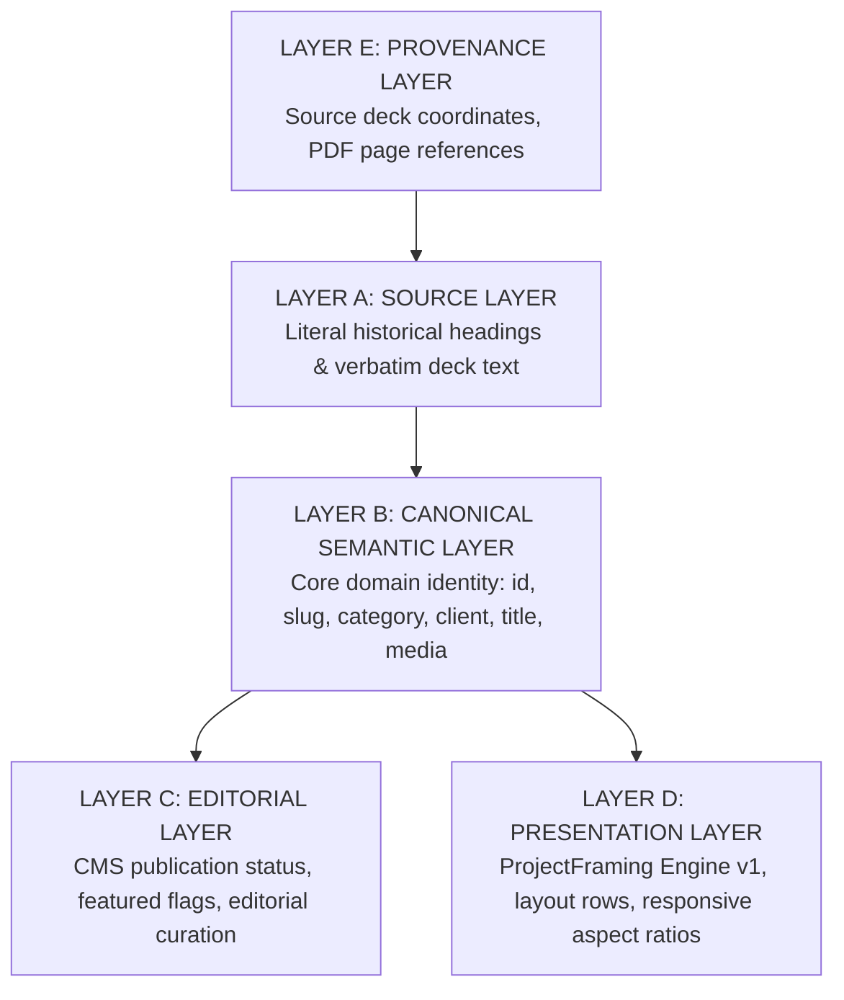

# DEPROS Canonical Portfolio Content Model

**Pass:** 05B.1 — Canonical Portfolio Content Model Refinement  
**Date:** October 2026  
**Auditor / Architect:** Antigravity AI  
**Repository:** `nalakara/DEPROS`  
**Document Status:** Refined Semantic Content Contract & Architecture Specification (Model Refinement Only — No Code Changes)

---

## 1. Architectural Principles & Layered Architecture

This specification establishes the canonical semantic content model for the DEPROS portfolio. It provides a clean, presentation-independent, and source-grounded content contract designed to:
1. Support the current hard-coded portfolio presentation.
2. Power the upcoming `/work` archive and category filtering system.
3. Serve as the data contract for future individual project detail routes (`/work/[slug]`).
4. Enable seamless future migration to a headless CMS or structured content store (e.g. Sanity, Payload, Markdown/MDX collections) without schema rewrites.

### The Five Architectural Layers
To guarantee that business identity, historical deck artifacts, editorial workflows, and frontend rendering remain decoupled, the model establishes five distinct layers:



1. **Layer A — Source Layer:** What the DEPROS source deck (`PF DEPROS 2026_B.pdf`) literally provides (verbatim text, layout spreads, historical client numbering).
2. **Layer B — Canonical Semantic Layer:** What a portfolio entry *means* in domain terms, completely independent of how it is currently rendered or where it originated.
3. **Layer C — Editorial Layer:** Operational metadata used by content editors and the website (e.g. publication state, featured status, sorting priorities).
4. **Layer D — Presentation Layer:** Layout instructions and rendering configurations (e.g. `ProjectFraming` aspect ratios, gap tokens, grid layouts, responsive behaviors).
5. **Layer E — Provenance Layer:** Traceability metadata that records where existing records originated during migration, designed to be optional so future native CMS entries remain portable.

---

## 2. Category Taxonomy: Source vs. Canonical

### A. Source Category (Literal Historical Deck)
The primary source `PF DEPROS 2026_B.pdf` contains the following verbatim headers across pages 05–20:
- `01 / DEP ROS PRODUCT DESIGN` (Pages 05–12)
- `02 / DEP ROS BRAND IDENTITY` (Page 13)
- `03 / DEP ROS LOGOS` (Page 14)
- `04 / DEP ROS CORPORATE IDENTITY` (Page 15)
- `MARKETING KIT` *(Unnumbered header)* (Page 16)
- `SALES TOOLS` *(Unnumbered header)* (Page 17)
- `GRAPHIC & VISUAL` *(Unnumbered header)* (Page 18)
- `05/ DEP ROS SOCIAL MEDIA CONTENT` *(Printed with literal index `05`)* (Pages 19–20)

*Source Note:* The PDF numbers `01` through `04`, omits category numbers on `Marketing Kit`, `Sales Tools`, and `Graphic & Visual`, and then resumes numbering with `05` for `Social Media Content`. This numbering is treated as historical deck design, not as domain taxonomy.

---

### B. Canonical Semantic Categories (7 Stable Identifiers)
The canonical taxonomy establishes **7 stable semantic category IDs**. Semantic category definitions are strictly grounded in the source material without speculative extrapolation:

| Canonical Category ID | Display Label | Display Index | Source-Grounded Scope & Definition |
|---|---|---|---|
| `product-design` | Product Design | `01` | Product containers, packaging, label artwork, bottle & can design, and related product graphics. |
| `brand-identity` | Brand Identity | `02` | Visual identity systems, brand guidelines, identity collateral, uniforms, and branded merchandise. |
| `logos` | Logos | `03` | Logomarks, symbols, brand marks, and curated mark collections. |
| `corporate-identity` | Corporate Identity | `04` | Corporate stationery suites, business cards, identity manuals, and corporate collateral. |
| `marketing-kit` | Marketing Kit | `05` | Marketing publications, e-books, brochures, B2B sales presentations, and service kits. |
| `graphic-visual` | Graphic & Visual | `06` | Environmental graphics, spatial visuals, wall/floor imagery, cards, and visual artwork. |
| `social-media-content` | Social Media Content | `07` | Social media feeds, visual grid strategies, story templates, and promotional social content. |

#### Semantic Identity Principle
Category identity, routing parameters, and CMS relationships are keyed exclusively to stable string identifiers (`product-design`), never to transient numeric prefixes (`"01"`). The numeric index `"01"` is an editorial display attribute that UI components can render or omit as desired.

---

## 3. Marketing Kit vs. Sales Tools Semantic Modeling

### Grounded Distinction
In the source PDF:
- Page 16 is explicitly headed `MARKETING KIT` (featuring *Eco Mailing E-Book*).
- Page 17 is explicitly headed `SALES TOOLS` (featuring *Suit Solution Group Service Kit*).

To preserve this factual distinction without artificially fragmenting the top-level 7-category taxonomy:
- **Canonical Category:** `marketing-kit`
- **Semantic Subtype (`contentSubtype`):**
  - `marketing-kit` (marketing collateral, e-books, publications)
  - `sales-tools` (sales presentations, pitch decks, service kits)
- **Source Provenance:** The literal PDF header (`"MARKETING KIT"` or `"SALES TOOLS"`) is preserved in the record's provenance block.

```typescript
// Eco Mailing (Page 16)
{
  category: "marketing-kit",
  contentSubtype: "marketing-kit",
  provenance: { sourceCategory: "MARKETING KIT", sourcePage: 16 }
}

// Suit Solution Group (Page 17)
{
  category: "marketing-kit",
  contentSubtype: "sales-tools",
  provenance: { sourceCategory: "SALES TOOLS", sourcePage: 17 }
}
```

---

## 4. Presentation Type Distinction

The canonical model defines two structural presentation types to describe the nature of the portfolio work:

```typescript
export type PresentationType = "standalone" | "grouped";
```

### 1. `standalone` (14 items in Source)
A portfolio presentation representing a single coherent client project or case study.
- Represents one specific engagement with an identifiable client.
- Examples: `janus-bifrous`, `coco-flamingo`, `kraken-rum`, `mitra-kopling`, `whysuper-millimeter`, `e-book-marketing`, `locale-social`.

### 2. `grouped` (2 items in Source)
A portfolio presentation representing a curated collection, index, or collage of multiple works rather than a single conventional project.
- Does not enforce a single client relationship.
- Prevents artificially dismantling overview spreads into speculative micro-records.
- Examples:
  1. `logos-collection` (Page 14): Selected marks and symbols across multiple clients (2020–2026).
  2. `graphic-visual` (Page 18): Environmental and spatial graphic design collage (`FLOOR / WALL IMAGES / VISUAL CARD / GRAPHIC & ELSE`).

---

## 5. Canonical Portfolio Entry Schema Contract

```typescript
/**
 * Canonical Semantic Category Identifiers
 */
export type SemanticCategoryId =
  | "product-design"
  | "brand-identity"
  | "logos"
  | "corporate-identity"
  | "marketing-kit"
  | "graphic-visual"
  | "social-media-content";

/**
 * Semantic Content Subtype
 * (Used only where genuine semantic distinction exists within a category)
 */
export type ContentSubtype =
  | "marketing-kit"
  | "sales-tools";

/**
 * Structural Presentation Type
 */
export type PresentationType = "standalone" | "grouped";

/**
 * Canonical Visual Asset Role
 */
export type MediaRole = "primary" | "detail" | "supporting" | "composite";

/**
 * Visual Asset Orientation
 */
export type MediaOrientation = "portrait" | "landscape" | "square" | "panoramic";

/**
 * Canonical Media Item (Asset Metadata)
 */
export interface CanonicalMediaItem {
  src: string;                  // Asset URI or CDN reference
  alt: string;                  // Descriptive accessible alt text
  width: number;                // Intrinsic physical width in pixels
  height: number;               // Intrinsic physical height in pixels
  aspectRatio?: number;         // Calculated width / height
  orientation?: MediaOrientation;
  role?: MediaRole;             // Semantic role within the project showcase
  caption?: string;             // Optional caption
}

/**
 * Layer D: Presentation Configuration
 * (Optional layout hints for rendering engines; decoupled from semantic identity)
 */
export interface PresentationFramingConfig {
  mode: "auto" | "editorial";
  editorialRows?: number[][];   // Image index grouping per row, e.g. [[0], [1, 2]]
  gap?: "none" | "hairline" | "sm" | "md";
  mobileStack?: boolean;
}

/**
 * Layer E: Source Provenance Metadata
 * (Audit and migration traceability; optional for future native CMS entries)
 */
export interface SourceProvenance {
  sourceDocument?: string;      // e.g. "PF DEPROS 2026_B.pdf"
  sourcePage?: number;          // e.g. 5
  sourceCategory?: string;      // e.g. "01 / DEP ROS PRODUCT DESIGN"
  sourceTitle?: string;         // e.g. "JANUS BIFROUS"
  sourceSubtitle?: string;      // e.g. "Artisan Beer"
  sourceClient?: string;        // e.g. "Locale Brewery"
}

/**
 * Canonical Portfolio Entry
 */
export interface CanonicalPortfolioEntry {
  // ── LAYER B: CANONICAL SEMANTIC CORE ──────────────────────────────
  id: string;                                // Immutable unique record ID (e.g. "janus-bifrous")
  slug: string;                              // URL routing identifier (e.g. "janus-bifrous")
  title: string;                             // Canonical project / presentation title

  category: SemanticCategoryId;              // Stable category identifier
  presentationType: PresentationType;        // "standalone" | "grouped"
  contentSubtype?: ContentSubtype;           // Optional semantic subtype (e.g. "sales-tools")

  client?: string;                           // Client name (if established by source)
  clientDisplayName?: string;                // Formatted display name if distinct from source string

  subtitle?: string;                         // Verified descriptor / subtitle
  description?: string;                      // Verified project summary (omitted if unverified)
  scope?: string[];                          // Array of verified services / deliverables

  year?: string;                             // Chronological year (omitted if unknown)

  media: CanonicalMediaItem[];               // Canonical array of visual assets

  // ── LAYER C: EDITORIAL METADATA ──────────────────────────────────
  featured?: boolean;                        // Homepage visibility flag
  published?: boolean;                       // Archive visibility flag
  order?: number;                            // Editorial sorting index

  // ── LAYER D: PRESENTATION CONFIGURATION ───────────────────────────
  framingConfig?: PresentationFramingConfig; // UI rendering layout instructions

  // ── LAYER E: SOURCE PROVENANCE ────────────────────────────────────
  provenance?: SourceProvenance;             // Migration traceability back to source deck
}
```

---

## 6. Identification: `id` vs. `slug`

The model strictly differentiates internal record identity from public routing:

| Field | Nature | Purpose | Mutability | Example |
|---|---|---|---|---|
| `id` | **Internal Identity** | Immutable database key, unique content record identifier. | **Immutable** | `"janus-bifrous"`, `"proj_01j4k9..."` |
| `slug` | **Public Routing** | Human-readable URL path segment used in web routing (`/work/[slug]`). | **Editable** | `"janus-bifrous"`, `"janus-artisan-beer"` |

*Guideline:* While initial implementations may use identical values for convenience (`id: "janus-bifrous"`, `slug: "janus-bifrous"`), decoupling them ensures future CMS editors can update URL slugs for SEO without breaking database relationships or internal IDs.

---

## 7. Media Architecture: Canonical Media vs. Presentation Hero

### Decoupling Media Assets from UI Expectations
The canonical content model does not require a rigid, hard-coded `heroImage: string` field on the semantic entity. Instead:
1. **Canonical Storage (`media`):** The portfolio item owns an array of visual assets (`media: CanonicalMediaItem[]`), each annotated with intrinsic dimensions and semantic roles (`"primary"`, `"detail"`, `"supporting"`, `"composite"`).
2. **Renderer Selection:** The website presentation layer derives its hero asset dynamically:
   - Evaluates the first item with `role: "primary"` or `role: "composite"`.
   - Defaults to `media[0]` if no explicit role is tagged.
   - For multi-image projects, passes the complete `media` array directly into the `ProjectFraming` renderer.

This prevents the content model from being coupled to a single-image assumption while fully preserving compatibility with single-image and multi-image projects alike.

---

## 8. Controlled Vocabulary & Data Classification

To maintain data integrity and prevent ungrounded assumptions, fields are classified into five distinct governance tiers:

| Tier | Governance | Fields in Model | Rules |
|---|---|---|---|
| **1. Controlled Semantic Enums** | Strict code-level types | `category`, `presentationType`, `contentSubtype`, `role`, `orientation` | Must match predefined taxonomy values. |
| **2. Source-Derived Free Text** | Verbatim extraction | `title`, `subtitle`, `client`, `sourceCategory`, `sourceTitle` | Must reflect source material without editorial rewrites. |
| **3. Project-Specific Metadata** | Optional facts | `year`, `scope`, `description` | Populated **only** when verified. Never guess or fabricate. |
| **4. Editorial Metadata** | CMS operational state | `featured`, `published`, `order` | Governed by site editorial strategy. |
| **5. Presentation Metadata** | Frontend layout hints | `framingConfig` (`mode`, `editorialRows`, `gap`, `mobileStack`) | Governed by the frontend rendering engine. |

---

## 9. The "Unknown Data" Rule

To prevent AI hallucination or premature editorial fabrication:
1. **No Speculative Chronology:** If the source deck does not state a year, `year` remains `undefined`. Do not insert the current year.
2. **No Fabricated Scope:** If deliverables or service scopes are not printed in the source, `scope` remains `undefined` or empty.
3. **No Synthetic Copy:** Prototyping descriptions generated during early development are classified as unverified and must remain optional.
4. **Preserve Unknown State:** An incomplete record is factually valid. A record without a description is superior to a record with a hallucinated description.

---

## 10. Canonical Catalog Mapping (All 16 Presentation Units)

The established 16 portfolio presentation units map cleanly to the refined canonical model:

| # | ID / Slug | Title | Canonical Category | Subtype | Presentation Type | Client | Source Page | Primary Asset Path |
|---|---|---|---|---|---|---|---|---|
| **01** | `janus-bifrous` | Janus Bifrous | `product-design` | — | `standalone` | Locale Brewery | 05 | `/images/projects/janus-bifrous/` (3 panels) |
| **02** | `coco-flamingo` | Coco Flamingo | `product-design` | — | `standalone` | Locale Brewery | 06 | `/images/projects/coco-flamingo/` (3 panels) |
| **03** | `kraken-rum` | Kraken Rum | `product-design` | — | `standalone` | Locale Brewery | 07 | `/images/projects/kraken-rum/` (3 panels) |
| **04** | `blonde-ale` | Blonde Ale / Golden Ale | `product-design` | — | `standalone` | Locale Brewery | 08 | `/images/projects/blonde-ale-hero.png` |
| **05** | `locale-fruit-wine` | Locale Fruit Wine | `product-design` | — | `standalone` | Locale Brewery | 09 | `/images/projects/locale-fruit-wine-hero.png` |
| **06** | `mini-liqueur-party` | Mini Liqueur Party | `product-design` | — | `standalone` | Locale Brewery | 10 | `/images/projects/mini-liqueur-party-hero.png` |
| **07** | `berassa-snack` | Berassa Snack | `product-design` | — | `standalone` | Gumindo Bogamanis | 11 | `/images/projects/berassa-snack-hero.png` |
| **08** | `arin-arak` | Arin Arak Liqueur | `product-design` | — | `standalone` | Arin | 12 | `/images/projects/arin-arak-hero.png` |
| **09** | `mitra-kopling` | Mitra Kopling | `brand-identity` | — | `standalone` | Kapal Api | 13 | `/images/projects/mitra-kopling/` (3 panels) |
| **10** | `logos-collection` | Logos Collection | `logos` | — | `grouped` | Multiple / Various | 14 | `/images/projects/logos-collection-hero.png` |
| **11** | `whysuper-millimeter` | Whysuper & Millimeter | `corporate-identity` | — | `standalone` | Whysuper & Millimeter | 15 | `/images/projects/whysuper-millimeter/` (3 panels) |
| **12** | `e-book-marketing` | E-Book Marketing Kit | `marketing-kit` | `marketing-kit` | `standalone` | Eco Mailing | 16 | `/images/projects/e-book-marketing-hero.png` |
| **13** | `sales-tools` | Service Kit Sales Tools | `marketing-kit` | `sales-tools` | `standalone` | Suit Solution Group | 17 | `/images/projects/sales-tools-hero.png` |
| **14** | `graphic-visual` | Graphic & Visual | `graphic-visual` | — | `grouped` | Various local brands | 18 | `/images/projects/bounce-bali-hero.png` |
| **15** | `locale-social` | Locale Instagram Feeds | `social-media-content` | — | `standalone` | Locale Brewery | 19 | `/images/projects/locale-social-hero.png` |
| **16** | `kopi-tungku` | Kopi Tungku Instagram Story | `social-media-content` | — | `standalone` | Kopi Tungku | 20 | `/images/projects/kopi-tungku-hero.png` |

---

## 11. Code Compatibility & Migration Mapping

The current implementation in `src/lib/types.ts` and `src/lib/data.ts` maps directly to this refined canonical model:

```typescript
// TARGET TYPES UPGRADE PATH (For Future Implementation Pass)

// 1. Current category union can be refactored to clean semantic IDs:
export type SemanticCategoryId =
  | "product-design"
  | "brand-identity"
  | "logos"
  | "corporate-identity"
  | "marketing-kit"
  | "graphic-visual"
  | "social-media-content";

// 2. Legacy Project interface can map smoothly via computed getters or backwards-compatible properties:
// - `image` (legacy fallback) -> derived from `entry.media[0].src`
// - `category` (legacy string "01 / PRODUCT DESIGN") -> computed as `${CATEGORY_MAP[entry.category].displayIndex} / ${CATEGORY_MAP[entry.category].displayName}`
// - `framingConfig` -> passed directly to existing ProjectFraming component
```

### Frozen Status of ProjectFraming Engine v1
The `ProjectFraming` renderer and `computeFramingRows` engine remain **frozen and unchanged**. The canonical content model treats framing configuration as an optional presentation hint, ensuring total rendering stability across all current and future portfolio views.
