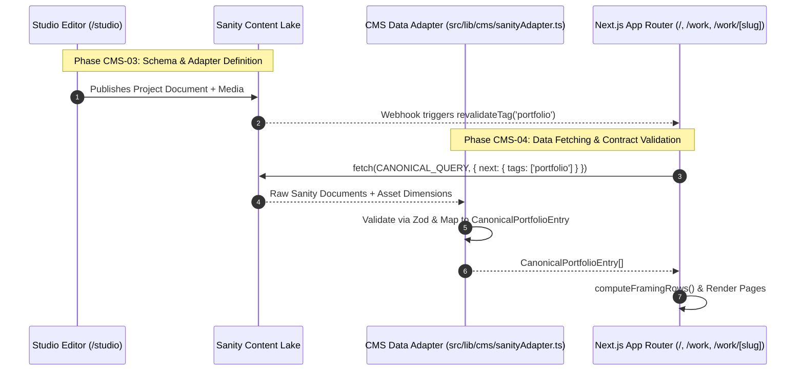

# DEPROS CMS Vendor & Architecture Evaluation

**Pass:** CMS-02 — CMS Vendor & Architecture Evaluation  
**Date:** October 2026  
**Repository:** `nalakara/DEPROS`  
**Primary Specification:** [`03_DEPROS_CMS_ARCHITECTURE_CONTRACT.md`](./03_DEPROS_CMS_ARCHITECTURE_CONTRACT.md)  
**Status:** Evaluation & Architectural Recommendation (No Dependencies Installed / No Implementation)

---

## 1. Executive Summary & Evaluation Premise

The DEPROS website separates system responsibilities into three distinct architectural tiers:

```mermaid
graph TD
    subgraph TIER1["TIER 1: CMS LAYER"]
        A[Content & Editorial Authority]
        A1[Projects, Clients, Media, Metadata]
    end

    subgraph TIER2["TIER 2: ADAPTER & VALIDATION LAYER"]
        B[Contract & Validation Authority]
        B1[Zod Schema, Type Narrowing, Data Derivations]
    end

    subgraph TIER3["TIER 3: DEPROS FRONTEND"]
        C[Presentation & Behavioral Authority]
        C1[Framing Engine, Aspect Math, Design Tokens, Routing]
    end

    TIER1 -->|Raw API Payload| TIER2
    TIER2 -->|CanonicalPortfolioEntry[]| TIER3
```

The objective of **CMS-02** is to rigorously evaluate realistic CMS solutions against the approved **DEPROS CMS Architecture Contract** ([`03_DEPROS_CMS_ARCHITECTURE_CONTRACT.md`](./03_DEPROS_CMS_ARCHITECTURE_CONTRACT.md)).

### Core Evaluation Principle
We do not ask *"Which CMS is generally best?"*  
We ask: **"Which CMS approach satisfies the approved DEPROS CMS Architecture Contract with the most appropriate balance of capability, operational simplicity, media fidelity, cost sustainability, portability, and minimal vendor coupling?"**

---

## 2. Evaluation Criteria

The criteria are derived directly from the DEPROS architecture contract:

1. **Content Modeling Precision:**
   - Ability to cleanly represent nested object arrays (`media[]`), strict categorical enums (7 semantic categories), relational document links (`Client`), and optional field groups (`framingConfig`, `provenance`).
2. **Media Architecture & Dimension Extraction:**
   - Automatic extraction of intrinsic `width` and `height` on upload (essential for zero Cumulative Layout Shift in the Framing Engine).
   - Storage of uncropped master assets, accessible `alt` text enforcement, and semantic `role` assignment (`primary`, `detail`, `supporting`, `composite`).
3. **Editorial Curation & Workflow:**
   - Independent `featured` toggle (for homepage showcase curation) and `published` status (draft staging).
   - Deterministic `order` control and live preview integration with Next.js App Router Draft Mode.
4. **Identity & Routing Integrity:**
   - Immutable record identity (`id`) separate from editable public URL route keys (`slug`) with unique slug validation.
5. **Next.js App Router Integration:**
   - Full compatibility with Next.js 15+ Server Components, `generateStaticParams` SSG, and on-demand tag revalidation (`revalidateTag()`).
6. **Architectural Decoupling & Portability:**
   - Clean data adapter boundary: zero CMS SDK types leaked into frontend UI components. Standard JSON export capabilities.
7. **Operational Burden:**
   - Hosting requirements, database administration, authentication overhead, backup workflows, and security maintenance.
8. **Cost & Sustainability:**
   - Realistic evaluation of free tiers, API bandwidth limits, asset storage quotas, and pricing predictability for a boutique creative studio.

---

## 3. In-Depth Evaluation of CMS Candidates

### Candidate 1: Sanity.io (Hosted Structured Content Platform)

#### Architecture
Sanity is a hosted structured content platform with a customizable React-based editorial studio (Sanity Studio). Schemas are declared in code (TypeScript), and content is stored in a real-time JSON document store (Sanity Content Lake) accessed via GROQ or GraphQL.

#### Evaluation Against DEPROS Contract
- **Content Modeling:** **Flawless.** Highly expressive schema API. Supports nested `media[]` arrays, strict string enums, bidirectional references (`Client`), and collapsible fieldsets (`framingConfig`, `provenance`).
- **Media Architecture:** **Industry Standard.** Sanity's asset pipeline automatically parses and stores asset metadata on upload: `dimensions: { width, height, aspectRatio }`, EXIF data, and LQIP hash. Uncropped source files are served via global CDN.
- **Editorial Experience:** Excellent. Instant `featured` / `published` toggles, drag-and-drop array sorting, real-time collaborative editing, and Next.js Visual Editing / Draft Mode integration.
- **Next.js Integration:** Tier 1. Official `@sanity/next-sanity` library with tag-based caching (`revalidateTag('portfolio')`), Server Components, and embedded studio at `/studio`.
- **Operational Burden:** **Zero.** Fully managed SaaS. No databases, connection pools, or servers to configure.
- **Cost Profile:**
  - *Free Tier:* Generous (3 non-admin seats, 500k API CDN requests/mo, 100k API non-CDN requests/mo, 100GB bandwidth, 10GB asset storage).
  - *Sustainability:* Completely covers a boutique design studio's traffic without paid upgrades.
- **Lock-in Risk:** Low. One-command CLI export to raw JSON Lines (`sanity dataset export`).

---

### Candidate 2: Payload CMS 3.x (Next.js-Native Fullstack CMS)

#### Architecture
Payload 3.x is an open-source, code-first TypeScript CMS that runs natively within the same Next.js process as the application, persisting data to PostgreSQL, SQLite, or MongoDB.

#### Evaluation Against DEPROS Contract
- **Content Modeling:** **Exceptional.** TypeScript code-first collection schemas. Native support for nested arrays, relationships, and custom validation hooks.
- **Media Architecture:** **Strong.** Built-in upload collections use `sharp` to extract `width`, `height`, and mime types automatically. Assets can be stored locally or pushed to S3/Cloudflare R2.
- **Editorial Experience:** Very clean admin UI running at `/admin`. Supports Drafts & Versions, preview URLs, and customizable dashboard views.
- **Next.js Integration:** Deepest possible integration. Direct local database queries (`payload.find()`) bypass HTTP latency during build time.
- **Operational Burden:** **Moderate to High.** Requires provisioning and managing an external PostgreSQL database (e.g. Supabase, Neon, Railway) and S3-compatible cloud bucket (e.g. Cloudflare R2), plus running database migrations.
- **Cost Profile:**
  - *Software:* 100% Free and open-source.
  - *Infrastructure:* ~$0 to $10/mo depending on database/bucket provider tier.
- **Lock-in Risk:** **Zero.** Complete code and database ownership.

---

### Candidate 3: Strapi 5 (Self-Hosted / Cloud Node.js CMS)

#### Architecture
Strapi is an open-source Node.js headless CMS with a GUI-based Content-Type Builder, supporting PostgreSQL, MySQL, and SQLite.

#### Evaluation Against DEPROS Contract
- **Content Modeling:** Good. Supports single types, collection types, and repeatable components for `media[]`.
- **Media Architecture:** Good. Media library extracts dimensions, but API response structure is deeply nested and verbose (`data.attributes...`), requiring heavier adapter transformation.
- **Editorial Experience:** Traditional admin dashboard. Draft & Publish is standard.
- **Next.js Integration:** Standard REST/GraphQL HTTP fetching. Requires custom webhook endpoints to trigger Next.js tag revalidations.
- **Operational Burden:** **High.** Requires a dedicated Node.js application server, SQL database, and asset storage. High maintenance overhead for version updates.
- **Cost Profile:** Community Edition is free for self-hosting; Strapi Cloud starts at $29/mo.
- **Lock-in Risk:** Low to Moderate. Standard SQL database, but migration out requires restructuring component models.

---

### Candidate 4: Contentful (Enterprise SaaS Headless CMS)

#### Architecture
Contentful is an enterprise-grade cloud headless CMS providing REST (Content Delivery API) and GraphQL content endpoints.

#### Evaluation Against DEPROS Contract
- **Content Modeling:** Strong web-based content model builder. Supports references, enums, and nested arrays.
- **Media Architecture:** Strong. Dedicated Asset model with automated dimension capture and Fastly image delivery.
- **Editorial Experience:** Polished enterprise UI, scheduled publishing, role-based workflows.
- **Next.js Integration:** Solid. Official SDK, GraphQL API, and Draft Mode support.
- **Operational Burden:** **Zero.** Fully managed SaaS.
- **Cost Profile & Commercial Risk:**
  - *Free Tier:* Limited to 25,000 records and **only 5 user seats**.
  - *Pricing Cliff:* Upgrading beyond free tier jumps to **$300+/mo**, creating an unacceptable cost cliff for an independent studio.
- **Lock-in Risk:** Moderate to High. Complex custom Rich Text AST and proprietary SDK semantics.

---

### Candidate 5: Keystatic / Git-Based CMS (Local Repository Store)

#### Architecture
Keystatic is a Git-backed, TypeScript-defined content manager designed for Next.js. It writes content directly into the repository as structured JSON/YAML/Markdoc files.

#### Evaluation Against DEPROS Contract
- **Content Modeling:** Good. TypeScript schema definition for collections and singletons.
- **Media Architecture:** **Constraint:** Images are written to `public/images/`. Because there is no live server upload hook, **intrinsic dimensions (`width`, `height`) must be extracted at build time via `sharp` in the adapter layer** or manually entered.
- **Editorial Experience:** Clean local/hosted UI (`/keystatic`). Content updates trigger Git commits and CI/CD builds.
- **Next.js Integration:** Direct filesystem access (`fs`) during SSG builds. Extremely fast with zero network requests.
- **Operational Burden:** **Minimal.** Zero databases or external SaaS dependencies; entirely versioned in Git.
- **Cost Profile:** 100% Free.
- **Lock-in Risk:** **Zero.** Pure local JSON/YAML files.

---

## 4. Comprehensive Comparison Matrix

| Evaluation Dimension | Sanity.io | Payload CMS 3.x | Strapi 5 | Contentful | Keystatic (Git) |
|---|---|---|---|---|---|
| **Content Modeling Fidelity** | ⭐⭐⭐⭐⭐ (Code JSON) | ⭐⭐⭐⭐⭐ (TS Code-first) | ⭐⭐⭐⭐ (GUI Components) | ⭐⭐⭐⭐ (Web UI) | ⭐⭐⭐⭐ (TS Collections) |
| **Media Dimension Extraction** | ⭐⭐⭐⭐⭐ (Automatic SaaS) | ⭐⭐⭐⭐⭐ (Automatic Sharp) | ⭐⭐⭐⭐ (Plugin Extraction) | ⭐⭐⭐⭐⭐ (Automatic Fastly) | ⭐⭐⭐ (Build-time probe) |
| **Framing Engine Compatibility** | **100% Native** | **100% Native** | **100% Native** | **100% Native** | **Requires Adapter Probe** |
| **Next.js 15+ App Router** | ⭐⭐⭐⭐⭐ (`next-sanity`) | ⭐⭐⭐⭐⭐ (Embedded Engine) | ⭐⭐⭐⭐ (REST/GraphQL API) | ⭐⭐⭐⭐ (CDA/GraphQL API) | ⭐⭐⭐⭐⭐ (Local Filesystem) |
| **Live Visual Draft Preview** | **Native Visual Editing** | **Native Draft Mode** | **Manual Iframe** | **Native Preview API** | **Git Branch Preview** |
| **Operational Maintenance** | **Zero (Managed SaaS)** | **Moderate (DB + S3)** | **High (Node + DB + S3)** | **Zero (Managed SaaS)** | **Zero (Git Only)** |
| **Vendor Portability / Export** | **High (`ndjson` CLI)** | **Maximum (Pure SQL)** | **High (SQL dump)** | **Moderate (CLI export)** | **Maximum (Local JSON)** |
| **Cost Predictability** | **$0 / High Limit** | **$0 Core + Infra** | **$0 + Server Cost** | **$0 / $300+ Cliff** | **$0 Free Forever** |

---

## 5. Canonical Contract Field-Mapping Feasibility Test

Testing the `CanonicalPortfolioEntry` schema mapping across all candidates:

| Field Group | Canonical Requirement | Sanity.io | Payload CMS 3.x | Strapi 5 | Contentful | Keystatic |
|---|---|---|---|---|---|---|
| **Identity** | `id`, `slug` | `_id`, `slug.current` | `id`, `slug` | `documentId`, `slug` | `sys.id`, `slug` | `slug` |
| **Category** | 7 semantic enums | `string` + `options.list` | `select` field | `enumeration` | `Symbol` dropdown | `fields.select()` |
| **Presentation** | `standalone` / `grouped` | `string` + `options.list` | `select` field | `enumeration` | `Symbol` dropdown | `fields.select()` |
| **Client Link** | Relational link | `type: 'reference'` | `type: 'relationship'` | `relation: 'oneToOne'` | `Link` reference | `fields.relationship()` |
| **Media Array** | `media: CanonicalMediaItem[]` | `array` of `object` | `array` of sub-fields | `repeatable component` | `Array` of Asset Links | `fields.array(object)` |
| **Dimensions** | `width`, `height` | `asset->metadata.dimensions` | `media.width / height` | `media.width / height` | `file.details.image` | Adapter `sharp` probe |
| **Editorial** | `featured`, `published`, `order` | `boolean`, `boolean`, `number`| `checkbox`, `number` | `boolean`, `integer` | `Boolean`, `Integer` | `fields.checkbox() / number()` |
| **Framing** | `framingConfig` (optional) | Collapsible field group | Collapsible group | Component | Group field | `fields.object()` |
| **Provenance** | `provenance` (read-only) | Read-only fieldset | Read-only field group | Read-only component | Collapsible field | `fields.object()` |

---

## 6. Decisive Architectural Recommendation

### Primary Recommendation: **Sanity.io**

**Verdict: THE STRONGEST ARCHITECTURAL & OPERATIONAL FIT FOR DEPROS.**

#### Rationale & Evidence
1. **Zero Infrastructure Burden:** DEPROS is a visual design and brand development studio. Sanity eliminates database provisioning, connection pools, and hosting maintenance, letting the team focus 100% on design and brand execution.
2. **First-Class Media Intelligence:** Sanity's automatic extraction of intrinsic image dimensions (`width`, `height`, `aspectRatio`) upon upload guarantees that DEPROS's Framing Engine computes exact flex-grow ratios and aspect containers deterministically, eliminating layout shift (CLS).
3. **App Router & Live Preview Synergy:** The `@sanity/next-sanity` integration provides on-demand tag revalidation (`revalidateTag('portfolio')`) and real-time visual editing overlays for draft reviews.
4. **Co-Located Studio Workflow:** Sanity Studio can be mounted directly at `/studio` within the Next.js application, preserving a single codebase repository.
5. **Sustainable Free Tier:** The free tier allowance (500k monthly API requests, 100GB CDN bandwidth) comfortably supports studio portfolio operations with zero financial risk.

---

### Secondary / Self-Hosted Alternative: **Payload CMS 3.x**

**Verdict: BEST IF FULL DATABASE OWNERSHIP IS MANDATED.**

#### Rationale
- If the studio strictly prohibits third-party SaaS platforms and requires complete ownership of the database (PostgreSQL/SQLite) and media storage (S3/R2), Payload CMS 3.x is the superior self-hosted choice.
- *Trade-off:* Requires provisioning, configuring, and maintaining external PostgreSQL databases, object storage buckets, and database migrations.

---

### Static / Zero-Account Alternative: **Keystatic (Git-Based)**

**Verdict: BEST IF CONTENT MUST RESIDE AS LOCAL COMMITS.**

#### Rationale
- If the studio prefers keeping all content as committed JSON files within the Git repository.
- *Trade-off:* Lacks automated upload processing; requires build-time asset dimension extraction in the adapter layer.

---

## 7. Implementation Roadmap (Next Phases)



| Phase | Milestone | Scope |
|---|---|---|
| **CMS-03** | **Schema & Adapter Layer** | Define Sanity schema types matching `03_DEPROS_CMS_ARCHITECTURE_CONTRACT.md` and implement `sanityAdapter.ts` with Zod validation. |
| **CMS-04** | **Content & Media Migration** | Execute migration script uploading 16 canonical records from `src/lib/data.ts` and project assets from `public/images/projects/` into Sanity. |
| **CMS-05** | **Frontend Data Integration** | Wire Next.js App Router pages (`/`, `/work`, `/work/[slug]`) to the adapter layer with on-demand ISR revalidation. |

---

### Final Architectural Confirmation

The vendor evaluation is complete. The architecture defined in [`03_DEPROS_CMS_ARCHITECTURE_CONTRACT.md`](./03_DEPROS_CMS_ARCHITECTURE_CONTRACT.md) remains completely intact, and **Sanity.io** is confirmed as the target CMS platform for DEPROS.
